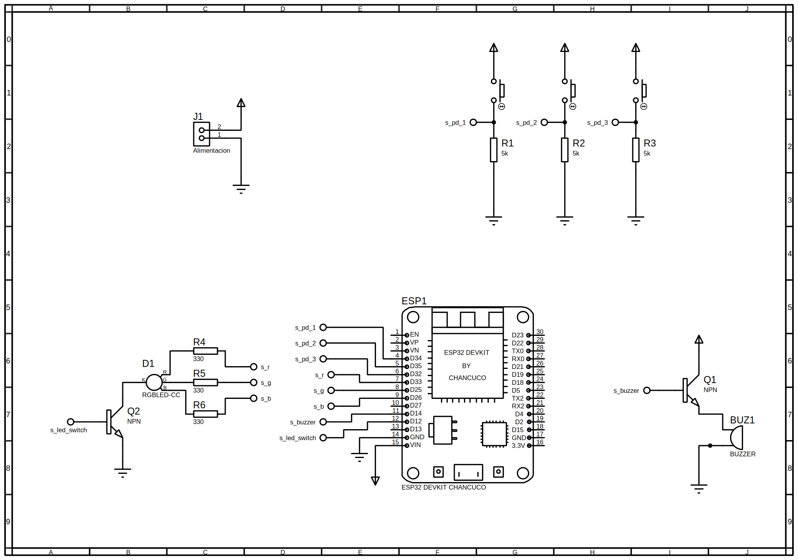

# Diseño del Circuito

## Esquema general
El circuito conecta:
- LED RGB a los pines D9, D10, D11.  
- Buzzer al pin D3.  
- Pulsador al pin D2 con resistencia pull-down.

## Diagrama
### Asignación de pines en ESP32
- [D34, D35, D32] ← Pulsadores
- [D14] → Buzzer
- [D33, D25, D26] → LED RGB
- [GND] → Común
- [VIN] → Alimentación

### Diagrama Final
